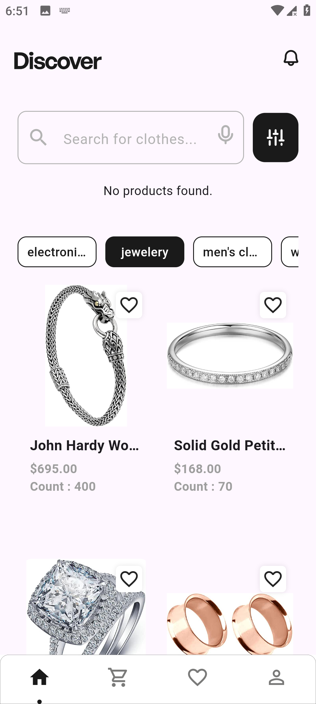
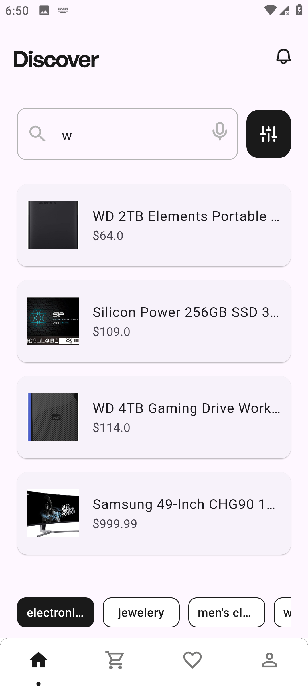
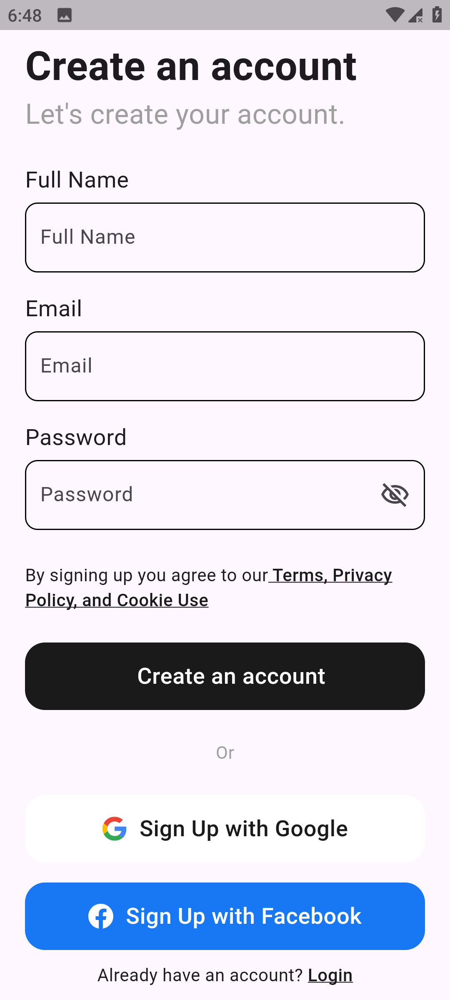

# 🛒 ecommerce_app

## 🖼️ Screenshots

<table>
  <tr>
    <td></td>
    <td></td>
    <td></td>
  </tr>
  <tr>
    <td></td>
    <td></td>
    <td></td>
  </tr>
  <tr>
    <td></td>
    <td></td>
    <td></td>
  </tr>
</table>

**ecommerce_app** is a modern, scalable Flutter e-commerce application that showcases best practices in mobile app development.  
It combines **Firebase** for authentication and database, **Cubit** for state management, and **REST APIs** for dynamic product content.

---

## 📱 About the App

This app simulates a full-featured e-commerce shopping experience with the following capabilities:

- User Registration & Login (via Firebase Auth)
- Product Browsing from a public API (FakeStoreAPI)
- Cart Management with item count & total price
- Order Confirmation with data saved to Firestore
- Clean UI with bottom navigation
- Fully responsive and maintainable architecture

---

## 🚀 Features

- ✅ Firebase Authentication (Email/Password)
- 🛍️ Product listing from REST API
- 🛒 Add to cart / Remove from cart
- 🧾 Place orders and save to Firestore
- 📄 View profile and order summary
- 🧠 Cubit (flutter_bloc) for clean state management
- 🔥 Feature-based modular architecture

---

## 🔗 Public API Used

We use the [FakeStoreAPI](https://fakestoreapi.com/) for fetching product listings:
- `https://fakestoreapi.com/products` - Get all products
- `https://fakestoreapi.com/products/{id}` - Get product details
- `https://fakestoreapi.com/cart/{id}` cart by id
- `https://fakestoreapi.com/cart/` - Get cart details

This API is free and perfect for demo/testing purposes.

---

